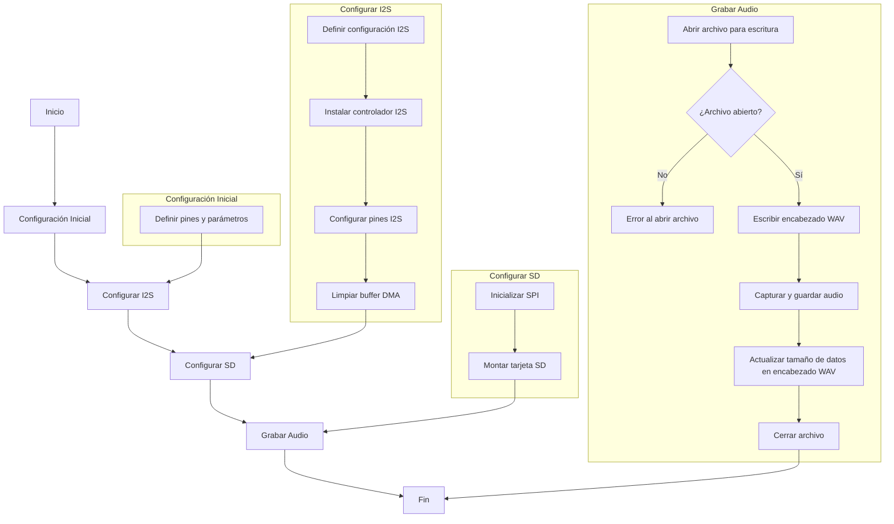

# Practica 7.Extra: Guardar arxivo audio de microfono a SD
## Objetivos: 
- Crear un archivo de audio a partir de un microfono (.WAV)
- Guardar dicho archivo de audio a la targeta SD.
## Materiales: 
- ESP32-S3
- Microfono I2S
- SD
- Adaptador SD
- Lector SD 
- Librerias: 
```
    lib_deps = 
	bblanchon/ArduinoJson@^7.0.4
	esphome/ESP32-audioI2S@^2.0.7
```
## Procedimiento: 
**Codigo:**
```cpp
    #include <Arduino.h>
    #include "Audio.h"
    #include <SD.h>
    #include <SPI.h>
    #include <driver/i2s.h>

    // Configuración del I2S
    #define I2S_WS 16
    #define I2S_SCK 17
    #define I2S_SD 15

    // Configuración de la tarjeta SD
    #define SD_CS 39

    // Configuración del archivo de audio
    #define FILE_NAME "/audio.WAV"
    #define SAMPLE_RATE 16000
    #define BITS_PER_SAMPLE I2S_BITS_PER_SAMPLE_16BIT
    #define CHANNEL_FORMAT I2S_CHANNEL_FMT_ONLY_LEFT
    #define BUFFER_SIZE 1024

    void setupI2S() {
    // Configurar el pinout del I2S
    i2s_config_t i2s_config = {
        .mode = (i2s_mode_t)(I2S_MODE_MASTER | I2S_MODE_RX),
        .sample_rate = SAMPLE_RATE,
        .bits_per_sample = BITS_PER_SAMPLE,
        .channel_format = CHANNEL_FORMAT,
        .communication_format = I2S_COMM_FORMAT_I2S_MSB,
        .intr_alloc_flags = ESP_INTR_FLAG_LEVEL1,
        .dma_buf_count = 4,
        .dma_buf_len = BUFFER_SIZE,
        .use_apll = false,
        .tx_desc_auto_clear = false,
        .fixed_mclk = 0
    };

    i2s_pin_config_t pin_config = {
        .bck_io_num = I2S_SCK,
        .ws_io_num = I2S_WS,
        .data_out_num = I2S_PIN_NO_CHANGE,
        .data_in_num = I2S_SD
    };

    // Inicializar el I2S
    i2s_driver_install(I2S_NUM_0, &i2s_config, 0, NULL);
    i2s_set_pin(I2S_NUM_0, &pin_config);
    i2s_zero_dma_buffer(I2S_NUM_0);
    }

    void setupSD() {
    // Inicializar la tarjeta SD
    SPI.begin(36, 37, 35); //  void begin(int8_t sck=-1, int8_t miso=-1, int8_t mosi=-1, int8_t ss=-1);
    if (!SD.begin(SD_CS)) {
        Serial.println("Error al montar la tarjeta SD");
        while (true);
    }
    }

    void recordAudioToFile(const char* filename, int duration) {
    // Abrir el archivo para escribir
    File file = SD.open(filename, FILE_WRITE);
    if (!file) {
        Serial.println("Error al abrir el archivo para escribir");
        return;
    }

    // Capturar y guardar audio
    int64_t endTime = millis() + duration;
    size_t bytesRead;
    uint8_t buffer[BUFFER_SIZE];

    while (millis() < endTime) {
        i2s_read(I2S_NUM_0, buffer, BUFFER_SIZE, &bytesRead, portMAX_DELAY);
        file.write(buffer, bytesRead);
    }

    // Cerrar el archivo
    file.close();
    }
    void setup() {
    // Iniciar la comunicación serie
    Serial.begin(115200);
    
    // Configurar I2S
    setupI2S();

    // Configurar SD
    setupSD();

    // Grabar audio por 10 segundos y guardarlo en un archivo
    recordAudioToFile(FILE_NAME, 10000);
    Serial.println("Grabación completada y guardada en la tarjeta SD");
    }

    void loop() {
    }

```
**Descripción:**<br>
Grabar audio y lo almacena en una tarjeta SD. La configuración inicial define los pines y parámetros necesarios para el protocolo I2S, que es un estándar para la transmisión de datos de audio digitales entre dispositivos, y la tarjeta SD, que servirá como almacenamiento para el audio grabado.<br>
La función ``setupI2S`` configura el protocolo I2S, especificando parámetros como la frecuencia de muestreo, el formato de bits, y otros detalles relacionados con la configuración de los pines y el formato de comunicación. Esta función instala el controlador I2S y configura los pines necesarios para la transmisión de datos de audio.<br>
La función ``setupSD`` inicializa la tarjeta SD utilizando el bus SPI. Se especifican los pines para la comunicación SPI y se intenta montar la tarjeta SD. Si la inicialización falla, el programa imprime un mensaje de error y entra en un bucle infinito para evitar continuar sin una tarjeta SD funcional.<br>
La función ``recordAudioToFile`` se encarga de grabar el audio y guardarlo en un archivo especificado en la tarjeta SD. Abre el archivo en modo de escritura y luego entra en un bucle que dura el tiempo especificado (en este caso, 10 segundos). Durante este tiempo, el audio se lee continuamente del bus I2S y se escribe en el archivo en la tarjeta SD. Al finalizar la grabación, el archivo se cierra para asegurar que todos los datos se escriban correctamente.<br>
En la función ``setup``, se inicializa la comunicación serie a una velocidad de 115200 baudios para la depuración. Luego se llaman a setupI2S y setupSD para configurar los módulos respectivos. Finalmente, se graba el audio durante 10 segundos llamando a recordAudioToFile. La función loop está vacía, ya que todas las operaciones importantes se realizan en el setup.<br><br>
**Última implementación:**<br>
Al principio tenía problemas con el archivo .WAV... He implementado la función:
```cpp
    void writeWavHeader(File file, int sampleRate, int bitsPerSample, int channels, int dataSize) {
    byte header[44];
    
    // Chunk ID "RIFF"
    header[0] = 'R'; header[1] = 'I'; header[2] = 'F'; header[3] = 'F';
    
    // Chunk size
    int chunkSize = dataSize + 36;
    header[4] = (byte)(chunkSize & 0xFF);
    header[5] = (byte)((chunkSize >> 8) & 0xFF);
    header[6] = (byte)((chunkSize >> 16) & 0xFF);
    header[7] = (byte)((chunkSize >> 24) & 0xFF);
    
    // Format "WAVE"
    header[8] = 'W'; header[9] = 'A'; header[10] = 'V'; header[11] = 'E';
    
    // Subchunk1 ID "fmt "
    header[12] = 'f'; header[13] = 'm'; header[14] = 't'; header[15] = ' ';
    
    // Subchunk1 size (16 for PCM)
    header[16] = 16; header[17] = 0; header[18] = 0; header[19] = 0;
    
    // Audio format (1 for PCM)
    header[20] = 1; header[21] = 0;
    
    // Number of channels
    header[22] = channels; header[23] = 0;
    
    // Sample rate
    header[24] = (byte)(sampleRate & 0xFF);
    header[25] = (byte)((sampleRate >> 8) & 0xFF);
    header[26] = (byte)((sampleRate >> 16) & 0xFF);
    header[27] = (byte)((sampleRate >> 24) & 0xFF);
    
    // Byte rate
    int byteRate = sampleRate * channels * bitsPerSample / 8;
    header[28] = (byte)(byteRate & 0xFF);
    header[29] = (byte)((byteRate >> 8) & 0xFF);
    header[30] = (byte)((byteRate >> 16) & 0xFF);
    header[31] = (byte)((byteRate >> 24) & 0xFF);
    
    // Block align
    int blockAlign = channels * bitsPerSample / 8;
    header[32] = (byte)(blockAlign & 0xFF);
    header[33] = (byte)((blockAlign >> 8) & 0xFF);
    
    // Bits per sample
    header[34] = bitsPerSample; header[35] = 0;
    
    // Subchunk2 ID "data"
    header[36] = 'd'; header[37] = 'a'; header[38] = 't'; header[39] = 'a';
    
    // Subchunk2 size
    header[40] = (byte)(dataSize & 0xFF);
    header[41] = (byte)((dataSize >> 8) & 0xFF);
    header[42] = (byte)((dataSize >> 16) & 0xFF);
    header[43] = (byte)((dataSize >> 24) & 0xFF);
    
    // Write the header to the file
    file.write(header, 44);
    }
```
Diseñada para escribir la cabecera de un archivo WAV en un archivo abierto en el sistema de archivos. La cabecera de un archivo WAV contiene metadatos importantes sobre el formato de audio, como la frecuencia de muestreo, el tamaño de muestra, el número de canales y la longitud de los datos de audio.<br>
Primero, se inicializa un arreglo de bytes llamado header con una longitud de 44 bytes, que es el tamaño estándar de una cabecera de archivo WAV. Luego, se asignan valores específicos a diferentes partes de la cabecera de acuerdo con el estándar de formato WAV.<br>
El primer campo de la cabecera es el Chunk ID, que especifica el tipo de archivo ("RIFF" para archivos WAV). A continuación, se calcula y asigna el tamaño del chunk, que incluye el tamaño de los datos de audio más 36 bytes adicionales para el resto de la cabecera.<br>
Se establece el formato del archivo como "WAVE" y se configuran los parámetros de la subcabecera fmt, como el tamaño del formato (16 para PCM), el formato de audio (1 para PCM) y el número de canales.<br>
Se proporciona la frecuencia de muestreo y se calcula y establece la tasa de bits de audio en bytes por segundo. Se especifica el tamaño del bloque y el tamaño de muestra en bits por muestra.<br>
Finalmente, se establece el Chunk ID de los datos ("data") y se asigna el tamaño de los datos de audio.<br>
Después de crear la cabecera del archivo WAV, se escribe en el archivo abierto, asegurando que los metadatos estén correctamente configurados antes de escribir los datos de audio en el archivo. Esta función es esencial para garantizar que el archivo WAV resultante sea compatible con los estándares y pueda ser reproducido correctamente por otros programas de audio.<br>

**Comprovación:**<br>
Esta és la comprobación por MATLAB de que se han leído datos en ese archivo y hay voz dentro:<br>
```m
    % Nombre del archivo de audio
    archivo = 'audio.WAV';

    % Verificar si el archivo existe
    if exist(archivo, 'file') == 2
        try
            % Leer el archivo de audio
            [y, Fs] = audioread(archivo);

            % Reproducir el audio
            sound(y, Fs);

            % Crear el gráfico de la forma de onda
            t = (0:length(y)-1)/Fs;
            figure;
            plot(t, y);
            title('Forma de Onda del Archivo de Audio');
            xlabel('Tiempo (s)');
            ylabel('Amplitud');
            grid on;

        catch ME
            disp('Error al leer el archivo de audio:');
            disp(ME.message);
        end
    else
        disp('El archivo audio.WAV no se encuentra en el directorio actual.');
    end
```


### Salida puerto serie: 
```
    Grabación completada y guardada en la tarjeta SD
```
### Diagrama de flujos: 

## Conclusión: 
Graba audio mediante el protocolo I2S y lo almacena en una tarjeta SD.